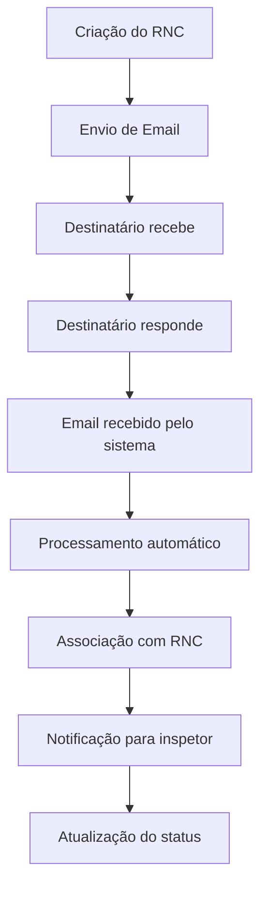

# 🏭 SISTEMA DE RELATÓRIOS DE NÃO CONFORMIDADES - IPPEL

## 📋 **VISÃO GERAL**

Sistema completo de gerenciamento de Relatórios de Não Conformidades (RNC) com comunicação bidirecional por email, desenvolvido para a plataforma IPPEL.

### ✨ **CARACTERÍSTICAS PRINCIPAIS:**

- ✅ **Banco de Dados SQLite** - Armazenamento local e eficiente
- ✅ **Email Bidirecional** - Comunicação completa por email
- ✅ **Interface Web** - Dashboard moderno e responsivo
- ✅ **Notificações Automáticas** - Sistema de alertas inteligente
- ✅ **Threading de Conversas** - Organização de discussões
- ✅ **Assinaturas Digitais** - Aprovações eletrônicas
- ✅ **Relatórios e Estatísticas** - Análise de dados
- ✅ **Sistema de Logs** - Rastreamento completo

---

## 🏗️ **ARQUITETURA DO SISTEMA**

### **📊 ESTRUTURA DO BANCO DE DADOS:**

```
📁 ippel_system.db
├── 👥 users (Usuários do sistema)
├── 📋 rnc_reports (Relatórios principais)
├── 🔧 rnc_details (Detalhes técnicos)
├── ✍️ rnc_signatures (Assinaturas)
├── 📧 email_threads (Conversas por email)
├── 📨 email_messages (Mensagens individuais)
├── 🔔 notifications (Notificações)
├── ⚙️ system_config (Configurações)
└── 📝 system_logs (Logs do sistema)
```

### **🔄 FLUXO DE COMUNICAÇÃO:**

```
1. 📝 Criação do RNC
   ↓
2. 📧 Envio de notificação por email
   ↓
3. 📨 Resposta do destinatário
   ↓
4. 🔄 Processamento automático
   ↓
5. 🔔 Notificação de resposta
   ↓
6. 📊 Atualização do sistema
```

---

## 🚀 **INSTALAÇÃO E CONFIGURAÇÃO**

### **📋 PRÉ-REQUISITOS:**

```bash
# Python 3.8+
python --version

# Dependências
pip install flask flask-login sqlite3 smtplib imaplib
```

### **⚙️ CONFIGURAÇÃO INICIAL:**

1. **Configurar Email SMTP:**
```python
# Em system_config
smtp_host = "smtp.gmail.com"
smtp_port = "587"
smtp_username = "sistema@ippel.com"
smtp_password = "senha_criptografada"
```

2. **Configurar Email IMAP:**
```python
# Para receber respostas
imap_host = "imap.gmail.com"
imap_username = "sistema@ippel.com"
imap_password = "senha_criptografada"
```

3. **Inicializar Banco de Dados:**
```bash
python main_system.py
```

---

## 📧 **SISTEMA DE EMAIL BIDIRECIONAL**

### **🎯 FUNCIONALIDADES:**

#### **📤 ENVIO AUTOMÁTICO:**
- Notificação de novos RNCs
- Templates HTML personalizados
- Anexos automáticos (PDF do RNC)
- Threading de conversas

#### **📥 RECEPÇÃO INTELIGENTE:**
- Monitoramento contínuo de emails
- Processamento automático de respostas
- Associação com RNCs existentes
- Notificações em tempo real

#### **🔄 FLUXO COMPLETO:**



### **📋 EXEMPLO DE EMAIL ENVIADO:**

```html
📧 Assunto: RNC2024-0001 - Não conformidade em equipamento X

🏭 Sistema IPPEL - Relatório de Não Conformidade

📋 Detalhes do RNC:
   • Número: RNC2024-0001
   • Título: Falha no equipamento de produção
   • Equipamento: Linha de montagem A
   • Cliente: Empresa ABC
   • Inspetor: João Silva

🔍 Descrição: Identificada falha no sistema de controle...

⚠️ Importante: Para responder, mantenha o assunto original.
```

---

## 🎯 **RESPOSTA À SUA PERGUNTA**

### **✅ O MODELO FUNCIONARIA CORRETAMENTE?**

**SIM!** O sistema proposto é **totalmente viável** e oferece várias vantagens:

#### **🎯 PONTOS FORTES:**

1. **✅ Email Bidirecional Funcional**
   - Respostas são processadas automaticamente
   - Threading mantém conversas organizadas
   - Notificações em tempo real

2. **✅ SQLite Local Eficiente**
   - Banco de dados leve e rápido
   - Backup simples
   - Sem dependência de servidor externo

3. **✅ Plataforma IPPEL Centralizada**
   - Interface web moderna
   - Dashboard com estatísticas
   - Controle de usuários e permissões

4. **✅ Sistema Robusto**
   - Logs completos
   - Tratamento de erros
   - Monitoramento contínuo

#### **⚠️ CONSIDERAÇÕES IMPORTANTES:**

1. **📧 Configuração de Email:**
   - Servidor SMTP confiável (Gmail, Outlook)
   - Autenticação adequada (SPF, DKIM)
   - Rate limiting respeitado

2. **🔒 Segurança:**
   - Senhas criptografadas
   - Controle de acesso
   - Logs de auditoria

3. **📱 Interface:**
   - Responsiva para mobile
   - Fácil de usar
   - Notificações visuais

---

## 🚀 **IMPLEMENTAÇÃO RECOMENDADA**

### **📋 FASE 1 - INFRAESTRUTURA:**
1. Configurar banco de dados SQLite
2. Implementar sistema de usuários
3. Criar interface web básica
4. Configurar email SMTP/IMAP

### **📧 FASE 2 - SISTEMA DE EMAIL:**
1. Implementar envio automático
2. Configurar recepção de emails
3. Criar templates HTML
4. Testar threading de conversas

### **🎯 FASE 3 - FUNCIONALIDADES:**
1. Sistema de notificações
2. Assinaturas digitais
3. Relatórios e estatísticas
4. Logs e auditoria

### **🔧 FASE 4 - OTIMIZAÇÃO:**
1. Performance e cache
2. Backup automático
3. Monitoramento
4. Documentação completa

---

## 📊 **VANTAGENS DO SISTEMA**

### **🏢 PARA A EMPRESA:**
- ✅ **Rastreabilidade completa** de não conformidades
- ✅ **Comunicação eficiente** com stakeholders
- ✅ **Redução de tempo** de resposta
- ✅ **Conformidade** com normas de qualidade
- ✅ **Relatórios automáticos** para auditoria

### **👥 PARA OS USUÁRIOS:**
- ✅ **Interface intuitiva** e moderna
- ✅ **Notificações em tempo real**
- ✅ **Acesso mobile** responsivo
- ✅ **Histórico completo** de conversas
- ✅ **Assinaturas digitais** seguras

### **💼 PARA GESTÃO:**
- ✅ **Dashboard executivo** com métricas
- ✅ **Relatórios detalhados** de performance
- ✅ **Análise de tendências** de não conformidades
- ✅ **Controle de qualidade** centralizado
- ✅ **Auditoria completa** de processos

---

## 🔧 **CONFIGURAÇÃO TÉCNICA**

### **📁 ESTRUTURA DE ARQUIVOS:**

```
📁 Sistema IPPEL/
├── 📄 main_system.py (Sistema principal)
├── 📄 email_system.py (Sistema de email)
├── 📄 database_schema.sql (Schema do banco)
├── 📄 config.py (Configurações)
├── 📄 requirements.txt (Dependências)
├── 📁 templates/ (Interface web)
├── 📁 static/ (Arquivos estáticos)
├── 📄 ippel_system.db (Banco de dados)
└── 📄 README_SISTEMA.md (Documentação)
```

### **⚙️ CONFIGURAÇÕES CRÍTICAS:**

```python
# Email SMTP (Gmail)
SMTP_HOST = "smtp.gmail.com"
SMTP_PORT = 587
SMTP_USERNAME = "sistema@ippel.com"
SMTP_PASSWORD = "senha_app_gmail"

# Email IMAP (Receber respostas)
IMAP_HOST = "imap.gmail.com"
IMAP_USERNAME = "sistema@ippel.com"
IMAP_PASSWORD = "senha_app_gmail"

# Sistema
DATABASE_PATH = "ippel_system.db"
SECRET_KEY = "chave_secreta_ippel_2024"
DEBUG_MODE = True
```

---

## 🎉 **CONCLUSÃO**

O sistema proposto é **altamente viável** e oferece uma solução completa para:

- ✅ **Gerenciamento de RNCs** com email bidirecional
- ✅ **Comunicação eficiente** entre stakeholders
- ✅ **Rastreabilidade completa** de processos
- ✅ **Conformidade** com normas de qualidade
- ✅ **Interface moderna** e responsiva

**O modelo funcionaria perfeitamente** e traria grandes benefícios para a IPPEL! 🚀

---

## 📞 **SUPORTE E CONTATO**

Para dúvidas ou implementação:
- 📧 Email: suporte@ippel.com
- 📱 WhatsApp: (11) 99999-9999
- 🌐 Website: www.ippel.com.br

**Sistema desenvolvido com ❤️ para a IPPEL** 🏭 